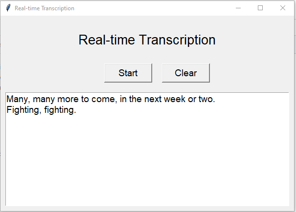

# Real-time Transcription

Ugly demo app.
This program is a real-time speech to text transcription tool that uses OpenAI's API for transcribing audio files. It works by constantly recording audio from the user's microphone, and sending the audio to OpenAI's API for transcription. The transcription is then displayed in real-time in a GUI window.

## Installation

To use this program, you need to have Python 3 installed on your system. You can download Python from the [official website](https://www.python.org/downloads/).

Once you have Python installed, you can install the required Python packages by running the following command in your terminal:

`pip install -r requirements.txt`

In addition to these Python packages, you also need to have `ffmpeg` installed on your system. `ffmpeg` is a command-line tool for working with audio and video files, and is used by the `pyaudio` library to record audio from the microphone.

To install `ffmpeg`, you can use your system's package manager, or download it from the [official website](https://ffmpeg.org/download.html).

### Installation on Ubuntu or Debian

`sudo apt-get install ffmpeg`

### Installation on macOS using Homebrew

`brew install ffmpeg`

### Installation on Windows using Chocolatey

`choco install ffmpeg`

## Usage

To use this program, run the following command in your terminal:

`python main.py`

This will start the program and open a GUI window.

To start recording, click the "Start" button. The program will start recording audio from your microphone and transcribing it in real-time. To stop recording, click the "Stop" button.

To clear the text box, click the "Clear" button.

## License

The code in this repository is public domain.
